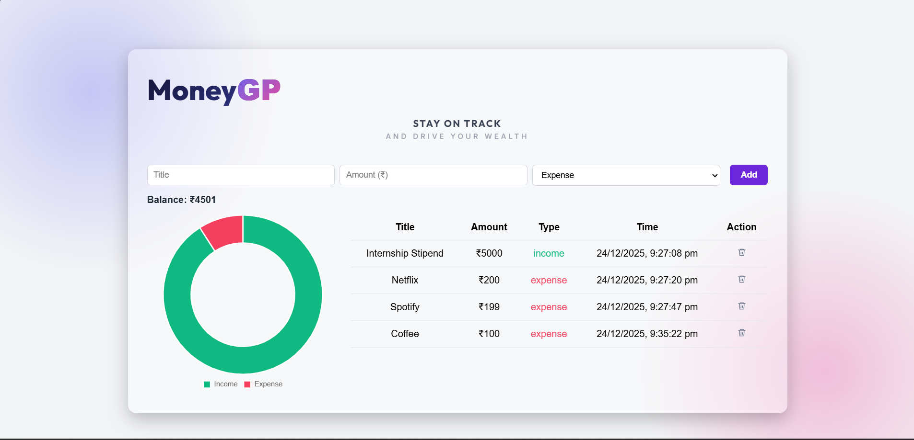

# MoneyGP 🏁

> **"STAY ON TRACK AND DRIVE YOUR WEALTH"**

A modern, aesthetically pleasing expense tracker built to manage personal finances with precision. I developed this as a **Semester Mini-Project** to practice DOM manipulation and explore modern UI/UX design principles.


*(A screenshot of the application running with sample data)*

## About The Project

Key focus areas during development:
1.  **Logic:** Handling the math for income vs. expenses accurately in real-time.
2.  **Persistence:** Using `localStorage` so users don't lose data on refresh.
3.  **Visuals:** Moving away from standard HTML styles to a custom "Fintech" aesthetic (Gradients, Glassmorphism, and specific color theory).

## Features

- **Modern Dashboard:** Clean UI using Google Fonts (**Outfit** & **Inter**) and a soft gradient background.
- **Dynamic Visualization:** Interactive Doughnut chart (via **Chart.js**) that updates instantly.
- **Transaction History:** Add, delete, and track entries with automatic timestamps.
- **Persistent Storage:** Data is saved to the browser, so it survives page reloads.
- **Smart Color Coding:** Visual cues (Emerald Green for Income, Rose Red for Expense) for quick scanning.

## Tech Stack & Design

* **HTML5** (Semantic structure)
* **CSS3** (Flexbox, CSS Variables, Custom Gradients - *No frameworks used*)
* **JavaScript** (ES6+ for logic and state management)
* **Libraries:** [Chart.js](https://www.chartjs.org/) (for the data visualization)
* **Fonts:** [Google Fonts](https://fonts.google.com/) (Outfit for headers, Inter for body text)

## Project Structure

```
moneygp-expense-tracker/
│
├── index.html          # Main application structure
├── style/
│   └── style.css       # Custom styling (Gradients, layout, responsive design)
├── scripts/
│   └── script.js       # App logic & Chart configuration
├── assets/
│   ├── favicon.png
│   └── dashboard-preview.png
└── README.md
```

## How to Run

1. Clone the repository.
2. Open the project folder.
3. Double-click index.html.

Note: Ensure you have an internet connection so the Chart.js library and Google Fonts can load.

Alternatively, you can view the live project here:  https://devanshtomar01.github.io/MoneyGP-Expense-Tracker/

## What I Learned

This project pushed me to look beyond basic tutorials. I spent time researching:
- Color Theory: How to use gradients and whitespace to make the app feel "premium" instead of cluttered.
- Chart.js Docs: Learning how to customize the doughnut chart to match my specific color palette (#10b981 & #f43f5e).
- State Management: Keeping the UI (HTML) in sync with the data (JavaScript Array) when deleting items.

## Future Improvements

- [ ] Add category selection (Food, Travel, Salary).
- [ ] Add a "Dark Mode" toggle.
- [ ] Export monthly reports as PDF.

## Author

Devansh Tomar B.Tech Computer Science Engineering
